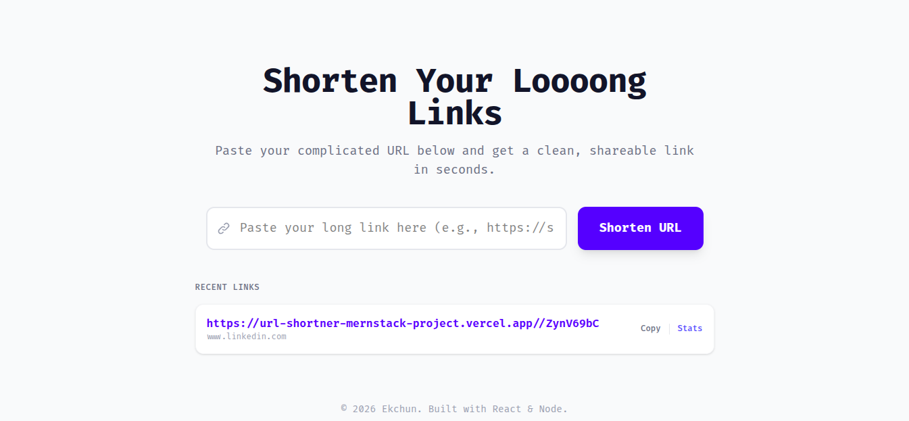
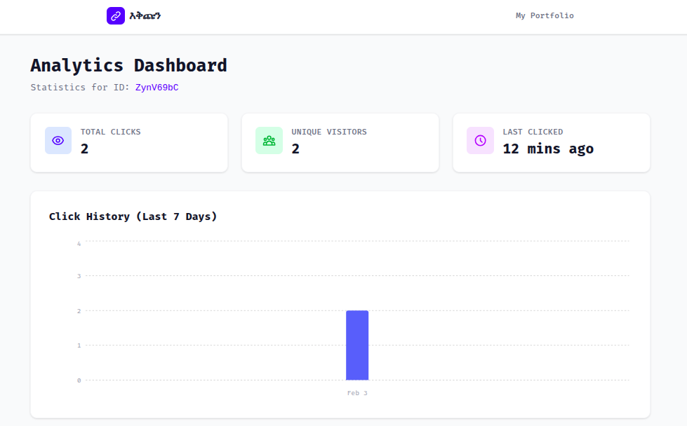

# 🚀 Ekchun - The Instant URL Shortener


**Ekchun** (meaning "main point") is a powerful, modern URL shortener built with the **MERN Stack**. It creates short, shareable links, tracks real-time analytics, and visualizes click data with beautiful interactive charts.

🔗 **Live Demo:** [https://url-shortner-mernstack-project-dzxt.vercel.app/](https://url-shortner-mernstack-project-dzxt.vercel.app/)

---

## ✨ Key Features

* **⚡ Instant Shortening:** Convert long, messy URLs into clean, short links in milliseconds.
* **📊 Advanced Analytics:** Track **Total Clicks**, **Unique Visitors**, and **Last Activity** time.
* **📈 Visual Data:** Interactive **Bar Charts** (powered by Recharts) visualize click history over time.
* **📜 Recent History:** Automatically saves your last 5 generated links (via LocalStorage) so you never lose them.
* **📱 Fully Responsive:** Built with **Tailwind CSS** for a seamless experience on mobile and desktop.
* **📋 One-Click Copy:** fast copy-to-clipboard functionality.

---

## 🛠️ Tech Stack

**Frontend:**
* ⚛️ **React (Vite)** - Blazing fast frontend.
* 🎨 **Tailwind CSS** - Modern styling.
* 📊 **Recharts** - Data visualization.
* 🔗 **Axios** - API requests.

**Backend:**
* 🟢 **Node.js & Express** - robust REST API.
* 🍃 **MongoDB & Mongoose** - Schema-based NoSQL database.
* 🆔 **NanoID** - Unique, collision-resistant ID generation.

**Deployment:**
* ☁️ **Vercel** - Hosting for both Client and Server.

---
## 📸 Screenshots

| Home Page | Analytics Dashboard |
|:---:|:---:|
|  |  |

## 🚀 Getting Started Locally

Follow these steps to run Ekchun on your local machine.

### 1. Prerequisites
Make sure you have the following installed:
* [Node.js](https://nodejs.org/) (v16 or higher)
* [MongoDB](https://www.mongodb.com/) (Local or Atlas)
* [Git](https://git-scm.com/)

### 2. Clone the Repository
```bash
git clone https://github.com/yishaq-official/url-shortner-mernstack-project.git

cd ekchun-url-shortener

```

### 3. Backend Setup

Navigate to the server folder and install dependencies:

```bash
cd server
npm install

```

Create a `.env` file in the `server` directory and add your MongoDB connection:

```env
MONGO_URI=mongodb+srv://<your-username>:<your-password>@cluster0.mongodb.net/ekchun
PORT=5000

```

Start the backend server:

```bash
node server.js
# Server runs on http://localhost:5000

```

### 4. Frontend Setup

Open a new terminal, navigate to the client folder, and install dependencies:

```bash
cd client
npm install

```

Create a `.env` file in the `client` directory:

```env
VITE_API_URL=http://localhost:5000

```

Start the React app:

```bash
npm run dev
# Client runs on http://localhost:5173

```

---

## 📡 API Endpoints

The backend exposes the following REST endpoints:

| Method | Endpoint | Description | Body |
| --- | --- | --- | --- |
| **POST** | `/url` | Create a new short link | `{ "url": "https://google.com" }` |
| **GET** | `/url/analytics/:id` | Get stats for a specific ID | N/A |
| **GET** | `/:id` | Redirect to the original URL | N/A |

---

## 📂 Folder Structure

```
ekchun/
├── client/          # React Frontend (Vite)
│   ├── src/
│   │   ├── components/  # Reusable UI components
│   │   ├── pages/       # Home & Dashboard pages
│   │   └── services/    # Axios API configuration
│   └── ...
├── server/          # Node.js Backend
│   ├── models/      # MongoDB Schema (Url.js)
│   ├── routes/      # API Routes
│   ├── controllers/ # Logic for shortening & statics
│   └── ...
└── README.md

```

---

## 🤝 Contributing

Contributions are welcome! If you have ideas for new features (like user accounts, QR codes, or custom aliases), feel free to fork the repo and submit a Pull Request.

1. Fork the Project
2. Create your Feature Branch (`git checkout -b feature/AmazingFeature`)
3. Commit your Changes (`git commit -m 'Add some AmazingFeature'`)
4. Push to the Branch (`git push origin feature/AmazingFeature`)
5. Open a Pull Request

---

## 👨‍💻 Author

**Yishaq Damtew**

* GitHub: [@yishaq-official](https://github.com/yishaq-official)
* Portfolio: [Coming Soon]

---

Built with ❤️ in Ethiopia.
